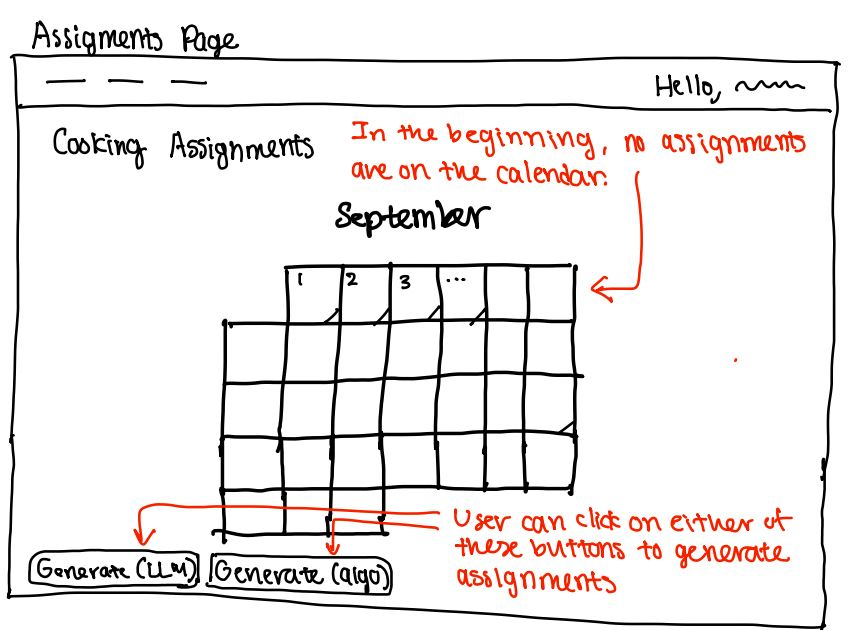
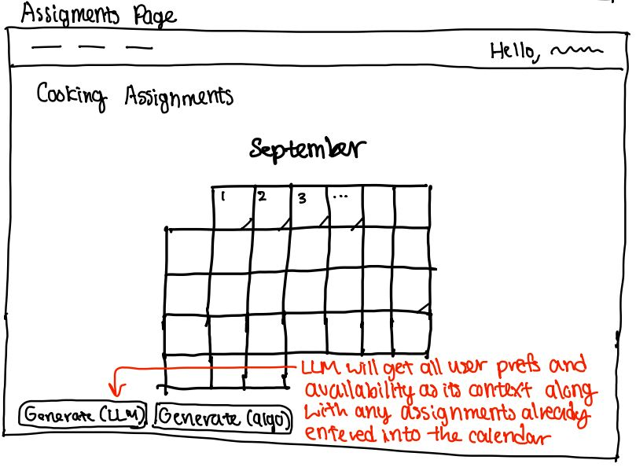
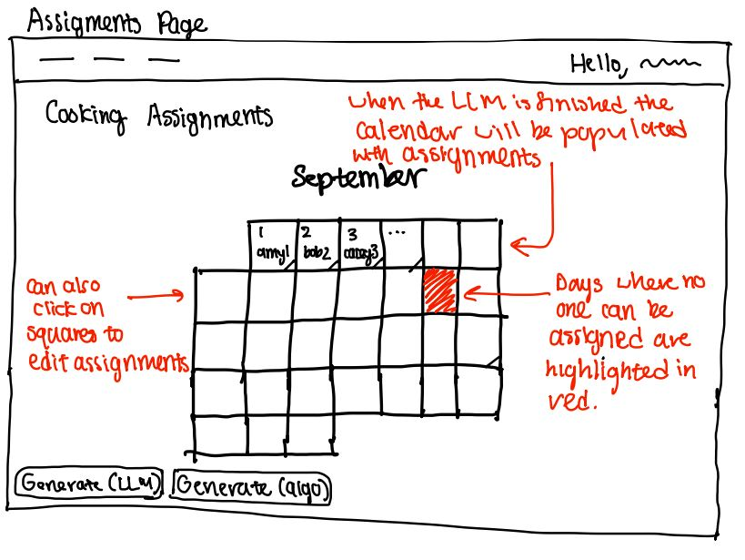

## Augmented Concept

### Original Concept Specification (Unchanged):

**concept** CookingAssignments\[UserAvailabilities, UserPreferences, User\]

**purpose** track cooking assignments for the month so we know who cooks when

**principle** after user availabilities and user preferences are uploaded, can automatically generate a set of cooking assignments, which can then be edited by foodstuds

**state**

a Month

a set of dates CookingDates

a set of Users

a UserAvailabilities Availabilities

a PreferredRoles Preferences

a set of Assignments with

&ensp; a date CookingDate

&ensp; a Lead

&ensp; an Assistant (optional)

**actions**

addCookingDate(date: Date):

**requires** date is not in CookingDates and date is in Month

**effects** adds date to CookingDates

assignLead(user: User, date: Date)

**requires** date is in CookingDates; user is in the set of Users

**effects** creates a new Assignment with date and Lead set to user if there is no existing Assignment for this date, or updates an existing Assignment if there already is an Assignment for this date

assignAssistant(user: User, date: Date)

**requires** date is in CookingDates; user is in the set of Users; there is already an Assignment with this date in the set of Assignments

**effects** sets Assistant in the existing Assignment for this date to be user

removeAssignment(date: Date)

**requires** there is an Assignment with this date in the set of Assignments

**effects** removes this Assignment from the set of Assignments

upload(preferredRoles: PreferredRoles)

**requires** all Users in preferredRoles are in the set of Users

**effects** sets Preferences to preferredRoles

upload(userAvailabilities: UserAvailabilities)

**requires** all Users in userAvailabilities are in the set of Users

**effects** sets Availabilities to userAvailabilities

generateAssignments()

**requires** user is in the set of Users for both Availabilities and Preferences

**effects** generates an assignment of Users to the CookingDates that violates no constraints in Availabilities or Preferences

validate(): boolean

**requires** no constraints in Preferences or Availabilities are violated across the Assignments

**effects** returns True

### LLM-Augmented Concept Specification:

I noticed some improvements that could be made to my original concept spec so I've made those improvements also. The spec is also located here: [cookscheduler.spec](./cookscheduler.spec)

**concept** CookingAssignments\[Availability, Preference, User\]

**purpose** create cooking assignments for the month so we know who cooks when

**principle**
user availabilities and preferences are uploaded by all users independently;
cooking dates are added based on WILG meal plan calendar;
can then use LLM to generate cooking assignments that satisfy the constraints;
can also edit the resulting assignments;

**state**

a Month

a Year

a set of dates CookingDates

a set of Users Cooks

a set of Availability Availabilities with

&ensp; a User

&ensp; a set of Dates

a set of Preference Preferences with

&ensp; a User

&ensp; a boolean CanSolo

&ensp; a boolean CanLead

&ensp; a boolean CanAssist

&ensp; a number MaxCookingDays

a set of Assignment Assignments with

&ensp; a Date

&ensp; a Lead

&ensp; an Assistant (optional)

invariants

&ensp; all dates in CookingDates are in Month in Year
&ensp; every Availability in Availabilities has a set of Dates that is a subset of CookingDates
&ensp; every Preference in Preferences has a nonnegative, integer maxCookingDays
&ensp; every Assignment in Assignments has a Date in CookingDates and a Lead in Cooks; if it has an Assistant, the Assistant is in Cooks

**actions**

setMonth(month: number):

**requires** month is an integer in \[1, 12\] and no assignments exist that have a date outside of this month

**effects** sets Month to month

setYear(year: number):

**requires** year is a nonnegative integer and no assignments exist that have a date outside

**effects** sets Year to year

addCookingDate(date: Date):

**requires** date is not in CookingDates and date is in Month

**effects** adds date to CookingDates

assignLead(user: User, date: Date)

**requires** date is in CookingDates; user is in the set of Users

**effects** creates a new Assignment with date and Lead set to user if there is no existing Assignment for this date, or updates an existing Assignment if there already is an Assignment for this date

assignAssistant(user: User, date: Date)

**requires** date is in CookingDates; user is in Cooks; there is already an Assignment with this date in the set of Assignments

**effects** sets Assistant in the existing Assignment for this date to be user

removeAssignment(date: Date)

**requires** there is an Assignment with this date in the set of Assignments

**effects** removes this Assignment from the set of Assignments

upload(preference: Preference)

**requires** the User in preference is in Cooks

**effects** adds preference to Preferences or updates Preferences if there is already a preference for the user

upload(availability: Availability)

**requires** the User in availability is in Cooks and all dates in availability are in CookingDates

**effects** adds availability to Availabilities or updates Availabilities if there is already a availability for the user

async generateAssignments()

**requires** the set of Users for both Availabilities and Preferences are subsets of Cooks and no existing Assignments violate those Availabilities and Preferences

**effects** generates an assignment of Users to the CookingDates via an algorithm that violates no constraints in Availabilities or Preferences and satisfies all prior existing Assignments

async generateAssignmentsWithLLM()

**requires** the set of Users for both Availabilities and Preferences are subsets of Cooks and no existing Assignments violate those Availabilities and Preferences

**effects** generates an assignment of Users to the CookingDates with an LLM that violates no constraints in Availabilities or Preferences and satisfies all prior existing Assignments

validate(): boolean

**requires** no constraints in Preferences or Availabilities are violated across the Assignments

**effects** returns True

## User Interaction

**User Journey:** Once the members of the house have uploaded their preferences and availabilities, one of the foodstuds will want to make the cooking calendar for the month. They enter CookScheduler and see an empty calendar. Perhaps they already know who needs to be assigned to certain days; for example, maybe one member can only cook on one day in the entire month. They enter these known assignments into the calendar. Then they click on the generate (LLM) button to ask the LLM to generate a set of cooking assignments. After a few moments of waiting, the LLM's assignments are populated into the calendar. Maybe one or two days are empty; the foodstud then goes into the WILG slack to ask if anyone is able to expand their availability so they can fill those days.

## Richer Test Cases

## Validators
